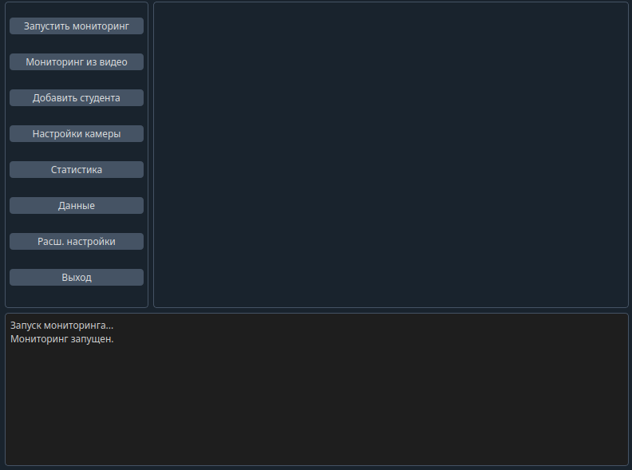
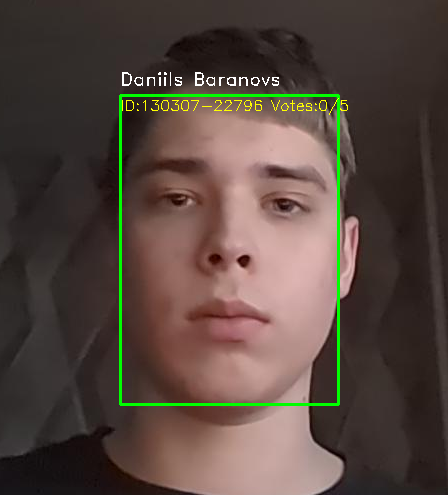
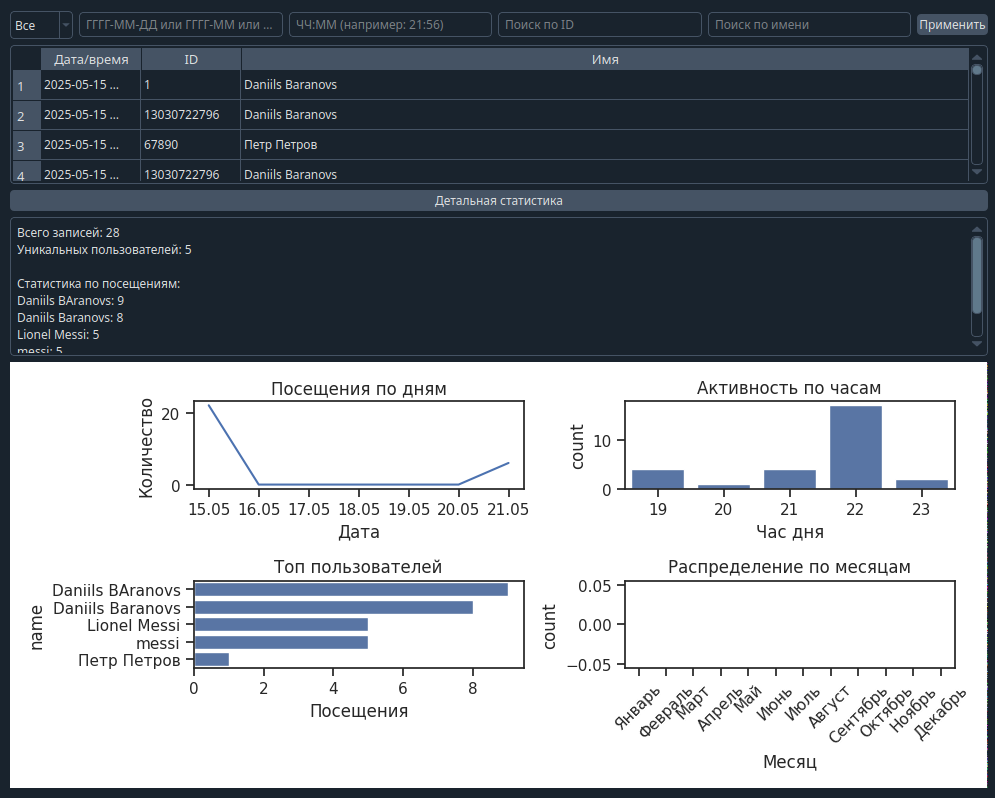

# 🎓 FaceTrackEd – Intelligent Facial Recognition Attendance System

**FaceTrackEd** is a smart, high-performance facial recognition attendance system for educational institutions. It utilizes **InsightFace** for accurate face analysis, a **vote-based identity verification system** for robustness, and a modern **PyQt6 GUI** for intuitive control and statistical visualization.

---

## 🚀 Overview

FaceTrackEd automates student attendance tracking by recognizing faces from a webcam or video/image input, logs attendance securely, and provides insightful statistics. It eliminates the inefficiencies of manual roll calls and is ideal for classrooms, labs, or training centers.

---

## 🔍 Key Features

### 🤖 Recognition System
- Powered by [InsightFace](https://github.com/deepinsight/insightface) for fast, high-accuracy recognition.
- Identity confirmation via a **voting mechanism**: a face must receive **5 positive votes** before being accepted as recognized.
- Threaded architecture for real-time performance.
- Alerts on unrecognized faces and provides enrollment prompts.

### 📊 Statistics Dashboard (GUI)
- Built with **PyQt6**, styled with **QDarkStyle** and **QtAwesome** icons.
- Real-time attendance charting with **Plotly** and **Matplotlib**.
- Visual attendance frequency, trends, and per-student history.
- Easy export of logs and graphical reports.

### 🧩 Modular System
- Clean separation of concerns across modules:
  - `face/recognition.py`: Handles recognition, voting, and real-time face tracking.
  - `database/db.py`: Manages CSV-based student and attendance data.
  - `stats/analytics.py`: Provides statistical computations.
  - `utils/helpers.py`: Shared utilities for file paths, timestamps, etc.
  - `core/app.py`: CLI + GUI entry logic.

---

## 🛠️ Technologies Used
- Python 3.x
- InsightFace
- OpenCV
- PyQt6
- Matplotlib
- Plotly
- Seaborn
- Pandas
- Scikit-learn

---

## 📁 Project Structure
FaceTrackEd/
├── main.py # Entry point
├── requirements.txt
├── README.md
├── config/
│ ├── settings.json # App-wide settings
│ └── settings.py # Settings loader
├── data/
│ ├── students.csv # Student registry (ID, name, encodings)
│ ├── log.csv # Attendance logs
│ └── faces/ # Stored student face images
├── app/
│ ├── core/app.py # CLI or GUI launcher
│ ├── face/recognition.py # InsightFace recognition logic with voting
│ ├── database/db.py # Data management
│ ├── stats/analytics.py # Attendance analytics
│ └── utils/helpers.py # Utilities and shared functions

---

## 🧠 How It Works

1. **Face Recognition (Real-Time)**
   - InsightFace detects faces and extracts embeddings.
   - The system compares with known encodings using **cosine similarity**.
   - A face must be detected and matched consistently to reach **5 votes** for confirmation.
   - Once confirmed, the attendance is logged automatically.

2. **Student Database**
   - Student data is saved in `students.csv`.
   - Encodings and face images are stored under `data/faces/`.
   - New students can be added via the GUI or CLI.

3. **Attendance Logging**
   - Attendance is recorded in `log.csv` with timestamp, student ID, and name.
   - Supports export and recovery of corrupted CSV data.

4. **GUI Mode**
   - Launches a styled PyQt6 window with full control over enrollment, attendance, stats, and logs.
   - Graphs are generated using Matplotlib and Plotly with support for real-time updates.

---

## 🛠️ Installation

1. Clone the repository:
   ```bash
   git clone https://github.com/your-username/FaceTrackEd.git
   cd FaceTrackEd
2.Create and activate a virtual environment:
python -m venv venv
# Linux/macOS:
source venv/bin/activate
# Windows:
venv\Scripts\activate
3.Install required packages:
pip install -r requirements.txt
4.Run the app:
python main.py

---

## 📊 Screenshots *(Optional)*  
*(Replace with actual screenshots after `` format)*  
**GUI Dashboard**  
  

**Recognition Process**  
  

**Analytics Overview**  
  

---

## 🧪 Testing  
- ✔️ **Multi-face recognition**: Simultaneous detection of up to 10 faces.  
- ✔️ **Unknown face handling**: Alerts and prompts for enrollment.  
- ✔️ **Voting-based verification**: Requires 5 consecutive matches for confirmation.  
- ✔️ **CSV corruption simulation**: Auto-recovery of damaged student/log files.  
- ✔️ **GUI stress test**: 50+ concurrent face detections without lag.  

---

## 📜 License  
This project is licensed under the **MIT License** - see the [LICENSE](LICENSE) file for details.  

---

## 🤝 Contributing  
1. Fork the repository.  
2. Create a feature branch: `git checkout -b feature/your-idea`.  
3. Commit changes: `git commit -m 'Add awesome feature'`.  
4. Push to branch: `git push origin feature/your-idea`.  
5. Open a **Pull Request**!  

**Guidelines**:  
- Follow PEP8 coding standards.  
- Add tests for new features.  
- Update documentation accordingly.  

---

## 📫 Contact  
**Project Lead**: Daniils Baranovs
- **Email**: [your.email@example.com](tmsthe70@gmail.com)  
- **GitHub**: [@your-username](https://github.com/your-Daniils12334)  

*Feel free to reach out for collaborations, bug reports, or feature requests!*  
